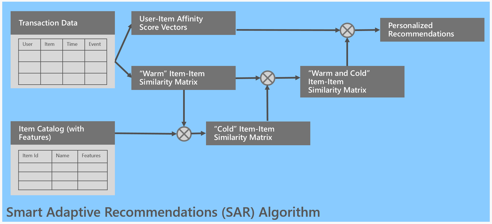

```ascii
 _ 
 \`*-.    
  )  _`-. 
 .  : `. . 
 : _   '  \ 
 ; *` _.   `*-._
 `-.-'          `-.
   ;       `       `.
   :.       .        :
   . \  .   :   .-'   . 
   '  `+.;  ;  '      :
   :  '  |    ;       ;-.
   ; '   : :`-:     _.`* ;
 .*' /  .*' ; .*`- +'  `*'
*-*   `*-*   `*-*'
```

# Smart Adaptive Recommendations (SAR) System

> **Note**: This project is a showcase version of a production recommendation system developed during professional work. It has been sanitized and open-sourced for demonstration purposes while maintaining the core architectural decisions and implementation patterns.

## Project Overview

This project demonstrates an automated product recommendation system using Microsoft's Smart Adaptive Recommendations (SAR) algorithm. The system analyzes customer interactions (conversions) to generate personalized product recommendations, which are then securely delivered through email campaigns.



> The SAR algorithm implementation is based on [Microsoft's Product Recommendations documentation](https://github.com/Microsoft/Product-Recommendations/blob/master/doc/sar.md).

### Business Context

The system was designed to solve the following challenges:
- Generate personalized product recommendations based on user interaction history
- Increase conversion rates through targeted email marketing
- Automate the recommendation process using cloud infrastructure
- Ensure secure and privacy-compliant handling of customer data

### Key Features

- **Interaction-based Learning**: Utilizes user-item interactions, timestamps, and revenue data
- **Automated Pipeline**: Fully automated using AWS Step Functions and ECS/Fargate
- **Scalable Architecture**: Containerized implementation for cloud deployment
- **Privacy-Focused**: Secure email handling with hashing and encryption
- **Production-Ready**: Includes monitoring, logging, and error handling

## Repository Structure

```
SAR/
├── src/                  # Source code
│   ├── evaluation/          # Evaluation metrics
│       ├── __init__.py
│       └── metrics.py
│   └── models/             # Model implementations
│       ├── __init__.py
│       ├── base.py
│       └── sar.py
│
├── showcase/             # Showcase implementation
│   └── docker/             # Docker configurations
│       ├── stage1_load/
│       ├── stage2_transform/
│       ├── stage3_segment_train/
│       ├── stage4_email_processing/
│       └── stage5_inject/
│
├── data/                # Data directory
│   └── synthetic_interactions.csv
├── notebooks/           # Jupyter notebooks
│   ├── quick_start.ipynb
│   └── synthetic_dataset_creation.ipynb
├── LICENSE             # License file
├── README.md           # Documentation
├── requirements.txt    # Python dependencies
├── sar.png            # SAR algorithm diagram
└── setup.py           # Package setup file
```

## Technical Implementation

- **Framework**: Microsoft Recommenders library (SAR algorithm)
- **Infrastructure**: AWS (ECS, Fargate, Step Functions, S3, CloudWatch)
- **Containerization**: Docker with multi-stage builds
- **Language**: Python
- **Data Processing**: Pandas, NumPy
- **Security**: Cryptographic email hashing, AWS KMS

## Pipeline Stages

1. **Data Loading**: Ingests raw interaction data (user, item, timestamp, revenue)
2. **Transformation**: Preprocesses data for SAR model consumption
3. **SAR Model**: Generates recommendations using Microsoft's SAR algorithm
4. **Email Processing**: Securely processes customer email data
5. **Injection**: Loads recommendations into production database

### Prerequisites
- AWS Account with appropriate permissions
- Docker installed locally
- Python 3.8+

## Deployment

The system is deployed on AWS using:
- ECS/Fargate for container orchestration
- Step Functions for pipeline workflow
- CloudWatch for monitoring and logging
- S3 for data storage
- IAM for security

## License

This project is licensed under the MIT License - see the [LICENSE](./LICENSE) file for details.

## Acknowledgments

- Microsoft Recommenders team for the SAR algorithm 
- AWS for the cloud infrastructure components
- The open-source community for various tools and libraries used in this project
